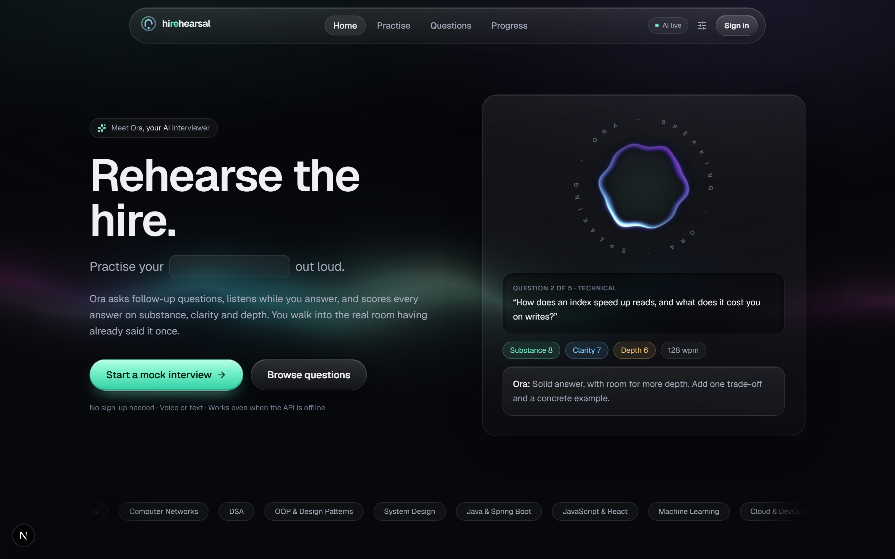
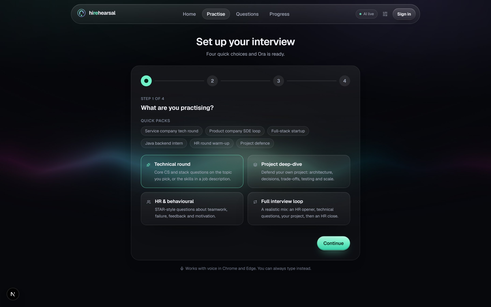
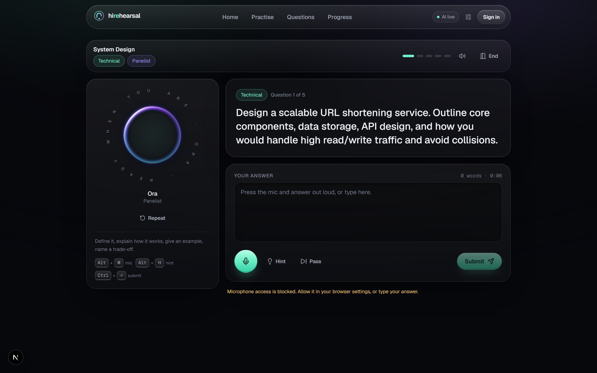
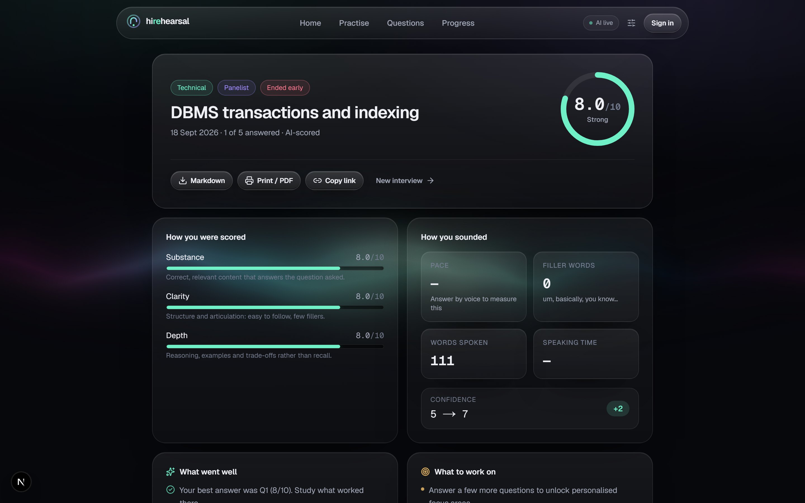
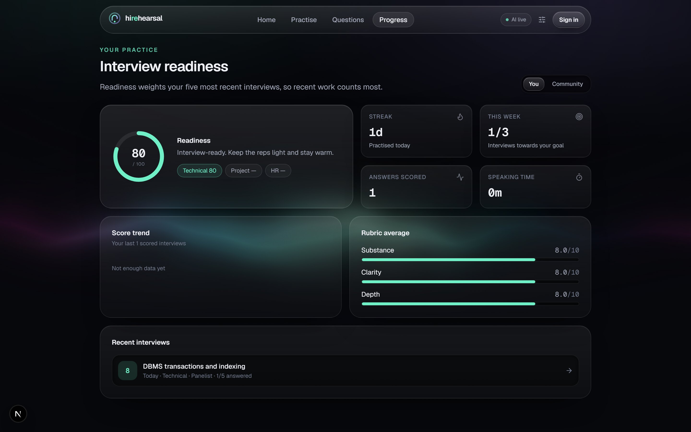
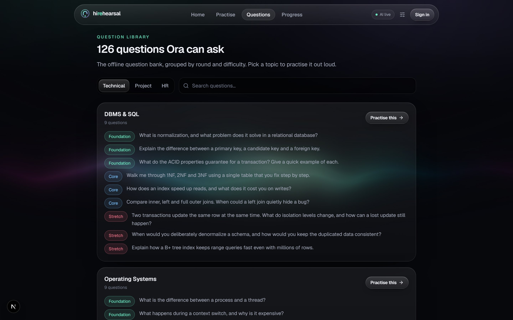

<div align="center">

# Hirehearsal

**Rehearse the hire.**

An AI mock-interview platform. Ora, the AI interviewer, runs technical, project and HR rounds out loud,
adapts its follow-ups to your answers, and hands you a scorecard with rubric scores, speaking analytics
and the two things to fix next.

[](https://spring.io/projects/spring-boot)
[](https://openjdk.org/)
[](https://nextjs.org/)
[](https://react.dev/)
[](https://tailwindcss.com/)
[](https://groq.com/)
[](#testing)



</div>

---

## Why it exists

Most people fail interviews they technically know the answers to. The first time you say something out
loud should not be in the room that counts. Hirehearsal gives you a low-stakes room where you can be bad
at answering first, with honest scoring on the things interviewers actually judge: **substance, clarity
and depth**.

## Features

| | |
| --- | --- |
| **Four interview formats** | Technical round, Project deep-dive, HR & behavioural, and a Full loop that opens with HR, moves through technical and project questions, then closes with HR — like a real placement loop. |
| **Three interviewers** | Mentor (warm), Panelist (balanced) and Bar raiser (strict). Each changes tone, starting difficulty, how quickly difficulty adapts and scoring leniency. |
| **Adaptive difficulty** | Every answer moves the next question between foundation, core and stretch tiers. |
| **Job-description tailoring** | Paste a JD and the technical questions follow the skills it mentions. |
| **Voice-first** | Ora speaks the questions; you answer out loud. Live transcript, word count, filler-word count and a per-answer timer. |
| **Honest scoring** | Every answer is scored 0-10 on substance, clarity and depth, with one actionable tip and an outline of what a strong answer covers. |
| **Speaking analytics** | Words per minute and filler words measured from your own answers, compared against a comfortable 110-165 wpm band. |
| **Scorecards** | Overall band, rubric averages, highlights, focus areas, full transcript, share link, Markdown export and print/PDF. |
| **Retry drills** | Send your weakest answers straight back into a short drill of exactly those questions. |
| **Progress** | Readiness score (0-100, weighted to recent interviews), practice streak, weekly goal, score trend and per-round readiness. |
| **Accounts, optional** | Practise as a guest, then create an account and your guest interviews are claimed into your history. |
| **Never blocked** | No API key or no network? A deterministic rule-based interviewer and a 126-question bank take over, in the browser if necessary. |

## Screenshots

| Set up an interview | The interview room |
| --- | --- |
|  |  |

| Scorecard | Progress dashboard |
| --- | --- |
|  |  |

<details>
<summary>Question library</summary>



</details>

## Architecture

```text
┌──────────────────────────────────────────────────────────────────────────────┐
│  Next.js 16 web app (App Router, React 19, Tailwind 4)                        │
│                                                                              │
│  /             landing          /room/[id]       live interview room          │
│  /start        setup wizard     /scorecard/[id]  scorecard + reflection       │
│  /library      question bank    /dashboard       readiness, streak, trends    │
│                                                                              │
│  lib/api  ── picks a transport ─┬─ remote  → fetch /api/*                     │
│                                 └─ local   → offline engine (localStorage)    │
│  lib/engine ── text · analyzer · coach · planner · scorecard (mirrors Java)   │
│  lib/speech ── Web Speech API: synthesis out, recognition in                  │
└───────────────────────────────┬──────────────────────────────────────────────┘
                                │  same-origin /api/*  (Next rewrite)
                                ▼
┌──────────────────────────────────────────────────────────────────────────────┐
│  Spring Boot 4.1 API (Java 17)                        :8085                  │
│                                                                              │
│  security/   stateless JWT (HS256) · CORS · per-client token-bucket limiter   │
│  interview/  InterviewService ─ short transactions around slow LLM calls,     │
│              optimistic locking, RoundPlanner, ScorecardAssembler             │
│  coach/      CoachService                                                     │
│                ├── LlmCoach  → PromptLibrary → OpenAiCompatibleGateway        │
│                │                                 └── LlmKeyPool (rotation)    │
│                └── HeuristicCoach + QuestionBank + AnswerAnalyzer  (fallback) │
│  progress/   readiness, streaks, weekly goal     insights/ community stats    │
│  web/        RFC 9457 problem responses                                       │
│                                                                              │
│  Spring Data JPA ──► H2 (dev, file) · PostgreSQL (prod)                       │
└───────────────────────────────┬──────────────────────────────────────────────┘
                                ▼
                    Groq OpenAI-compatible API (openai/gpt-oss-120b)
```

### Two engines, one contract

Scoring runs through the same rules whether or not a model is available:

- **LLM engine** — Groq scores the answer and writes the next question. Replies must be a single JSON
  object; anything malformed, out of range or duplicated is rejected.
- **Heuristic engine** — a transparent rule-based coach reads length, topical overlap, reasoning
  connectors, examples, signposting, filler ratio and (for HR rounds) STAR coverage.

Both read [`shared/question-bank.json`](shared/question-bank.json), which holds the 126-question bank,
the coaching copy and the scoring lexicon. `backend/.../coach/*.java` and `src/lib/engine/*.ts` are
deliberate mirrors of each other, so an interview taken offline in the browser is scored exactly like
one scored by the API.

### Design notes worth calling out

- **The database is never held open across an LLM call.** Each turn reads a snapshot in one short
  transaction, calls the coach with no transaction open, then writes in a second transaction guarded by
  the aggregate's `@Version`.
- **Key rotation with failover.** Several Groq keys rotate round-robin; a 429 parks a key for its
  `Retry-After` window and a 401/403 parks it longer, then the next key is tried.
- **Content never depends on JavaScript animation.** Questions, scores and panels animate with CSS, so a
  throttled frame loop can never leave the interview invisible.

## Tech stack

| Layer | Choices |
| --- | --- |
| Web | Next.js 16 (App Router), React 19, TypeScript 5.9, Tailwind CSS 4, Motion, GSAP, [React Bits](https://reactbits.dev) |
| API | Java 17, Spring Boot 4.1, Spring Security (OAuth2 resource server, HS256 JWT), Spring Data JPA, Bean Validation, `RestClient` |
| AI | Groq OpenAI-compatible chat completions, `openai/gpt-oss-120b` by default, JSON mode |
| Data | H2 file database in development, PostgreSQL in production |
| Ops | springdoc OpenAPI / Swagger UI, Actuator health probes, Docker, RFC 9457 problem details |
| Tests | JUnit 5, AssertJ, MockMvc — 36 unit and integration tests |

## Running it locally

**Prerequisites:** JDK 17+, Maven 3.9+, Node.js 20.9+.

### 1. The API

```bash
cp backend/.env.example backend/.env    # add your Groq key(s)
cd backend
mvn spring-boot:run
```

The API starts on **http://localhost:8085**.

- Swagger UI: http://localhost:8085/swagger-ui.html
- Status: http://localhost:8085/api/status
- H2 console (dev): http://localhost:8085/h2-console — JDBC URL `jdbc:h2:file:./data/hirehearsal`

Without a key the API still runs; interviews use the rule-based coach.

> If your `~/.m2/settings.xml` routes downloads through a private mirror that is offline, use
> `mvn -s .mvn/central-settings.xml spring-boot:run` to go straight to Maven Central.

### 2. The web app

```bash
npm install
npm run dev
```

Open **http://localhost:3000**. In development, `/api/*` is proxied to `http://localhost:8085`; set
`HIREHEARSAL_API_URL` in `.env.local` to point somewhere else.

### Testing

```bash
cd backend && mvn test     # 36 backend tests
npm run typecheck          # strict TypeScript
npm run build              # production build
```

## API

| Method | Path | Purpose |
| --- | --- | --- |
| `POST` | `/api/interviews` | Start an interview (guest or signed in) |
| `POST` | `/api/interviews/{id}/answers` | Score the answer, return the next question |
| `POST` | `/api/interviews/{id}/hint` | A nudge, at the cost of one point |
| `POST` | `/api/interviews/{id}/finish` | Save post-interview confidence and reflection |
| `GET` | `/api/interviews/{id}` | Scorecard (shareable by link) |
| `POST` | `/api/auth/register`, `/api/auth/login` | Get a bearer token |
| `GET` `PATCH` | `/api/me` | Profile, target role, weekly goal |
| `GET` | `/api/me/interviews` | Interview history |
| `GET` | `/api/me/progress?tz=Asia/Kolkata` | Readiness, streak, weekly goal, trend |
| `POST` | `/api/me/claim` | Attach guest interviews to the account |
| `GET` | `/api/insights` | Anonymous community statistics |
| `GET` | `/api/status` | Engine status; never exposes keys |

<details>
<summary>Example: start an interview</summary>

```bash
curl -X POST http://localhost:8085/api/interviews \
  -H 'Content-Type: application/json' \
  -d '{
    "track": "mixed",
    "persona": "panelist",
    "role": "Backend Developer Intern",
    "topic": "Java and Spring Boot",
    "projectName": "Hirehearsal",
    "questionCount": 5,
    "preConfidence": 5
  }'
```

</details>

## Configuration

| Variable | Default | Purpose |
| --- | --- | --- |
| `GROQ_API_KEYS` | none | Comma-separated Groq keys (or `GROQ_API_KEY` for one) |
| `HIREHEARSAL_LLM_MODEL` | `openai/gpt-oss-120b` | Any chat model your provider serves |
| `HIREHEARSAL_LLM_BASE_URL` | `https://api.groq.com/openai/v1` | Any OpenAI-compatible endpoint |
| `HIREHEARSAL_LLM_REASONING_EFFORT` | `low` | Leave blank for models without reasoning controls |
| `HIREHEARSAL_JWT_SECRET` | dev-only value | Required in the `prod` profile, 32+ bytes |
| `HIREHEARSAL_CORS_ORIGINS` | `http://localhost:*` | Allowed browser origins |
| `DATABASE_URL` `DATABASE_USERNAME` `DATABASE_PASSWORD` | H2 file | Production database |
| `PORT` | `8085` | API port |
| `HIREHEARSAL_API_URL` | `http://localhost:8085` in dev | Where the web app proxies `/api/*` |

Secrets live in `backend/.env`, which is gitignored. Keys are never logged, never returned by the API
and never sent to the browser.

## Deployment

```bash
docker build -f backend/Dockerfile -t hirehearsal-api .
docker run -p 8085:8085 \
  -e GROQ_API_KEYS=... \
  -e HIREHEARSAL_JWT_SECRET=... \
  -e HIREHEARSAL_CORS_ORIGINS=https://your-web-app \
  hirehearsal-api
```

Deploy the web app anywhere that runs Next.js and set `HIREHEARSAL_API_URL` to the API's public URL.
Without it, the app falls back to the in-browser interviewer.

## Project layout

```text
backend/            Spring Boot API
  src/main/java/com/hirehearsal/
    coach/          Ora: prompts, LLM gateway with key rotation, heuristic coach, question bank
    interview/      Entities, service, controller, round planner, scorecard assembler
    insights/       Community aggregates      progress/  Personal readiness and streaks
    security/       JWT, CORS, rate limiting  user/      Accounts
    web/            RFC 9457 problem responses
shared/             question-bank.json — questions, coaching copy and scoring lexicon
src/
  app/              Routes: landing, start, room, scorecard, dashboard, library, login
  components/       UI primitives, interview room, scorecard, dashboard, reactbits/
  lib/              api (remote + offline), engine (mirror of the Java coach), speech, storage
docs/screenshots/   Images used in this README
```

## Responsible AI

Ora introduces itself as an AI in every interview. Scores are practice signals, not hiring decisions.
Candidate text is framed as data inside every prompt, never as instructions. Guests are stored only in
their own browser, and community statistics are aggregate-only — no interview content is shared.

## Credits

UI components from [React Bits](https://reactbits.dev) (MIT + Commons Clause) live in
`src/components/reactbits/`, each with its source and any local adaptation noted at the top of the file.
